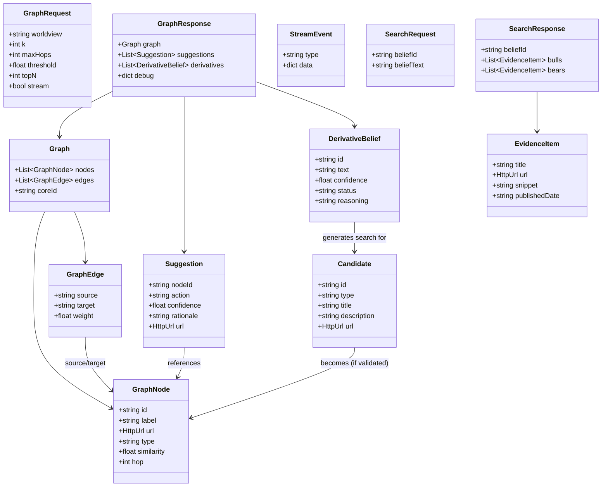

# Streaming Derivative Validation with EXA Search

## Overview

Add streaming validation of derivative beliefs using an LLM judge with confidence scoring, incremental graph updates via SSE, and a separate EXA search endpoint for bull/bear analysis.

## Architecture

### Flow

1. User submits worldview with `stream=true`
2. Generate 5 derivative beliefs (existing)
3. **NEW**: Validate each derivative in parallel with LLM judge → confidence score
4. **NEW**: Stream validation events to frontend via SSE
5. Filter derivatives by confidence threshold (>0.7)
6. Search Kalshi for validated derivatives (incremental)
7. Build graph as validated results come in
8. Stream graph updates to frontend

### Key Components

#### 1. ValidationClient (`server/app/validation.py`)

New class for LLM-as-judge validation:

- `validate_derivatives()` - scores each derivative belief
- Returns confidence score (0.0-1.0) for each belief
- Checks: independence, falsifiability, time-boundedness, derivative relationship to core belief
- Uses structured JSON output with reasoning

#### 2. Models Updates (`server/app/models.py`)

Add validation metadata:

- `DerivativeBelief` - new model with `text`, `confidence`, `status` (`pending`/`validating`/`validated`/`rejected`)
- `StreamEvent` - SSE event model with `type`, `data`
- Event types: `derivative_generated`, `derivative_validating`, `derivative_validated`, `derivative_rejected`, `graph_update`, `complete`

#### 3. SSE Streaming (`server/app/main.py`)

Update `/graph` endpoint:

- Check `stream` query parameter
- If `stream=true`: return `StreamingResponse` with `text/event-stream`
- If `stream=false`: keep existing behavior (backward compatible)
- Stream events as validation and graph building progresses

#### 4. EXA Search Client (`server/app/exa_client.py`)

New class for bull/bear analysis:

- `search_belief()` - finds sources supporting/contradicting a belief
- Returns structured bull/bear cases with source URLs
- Uses EXA's semantic search API

#### 5. Search Endpoint (`server/app/main.py`)

New `/search` endpoint:

- POST with `{beliefId: string, beliefText: string}`
- Returns `{bulls: [...], bears: [...]}` with sources
- Uses EXA client to find evidence

## Data Models

### Entity Relationship Diagram



### Key Points

**Data Storage**: Currently no persistent storage - all data is generated per-request and streamed. Future consideration: add database for caching derivatives, validation results, and graph snapshots.

**Validation Lifecycle**: Each `DerivativeBelief` flows through states: `pending` → `validating` → `validated`/`rejected` based on confidence threshold (0.7).

**Graph Building**: `Candidate` objects (from Kalshi search) become `GraphNode` objects when they pass similarity thresholds. Each node tracks which `hop` (distance) from core worldview.

---

## Detailed Model Specifications

### DerivativeBelief

```python
class DerivativeBelief(BaseModel):
    id: str
    text: str
    confidence: float = 0.0  # 0.0-1.0
    status: Literal["pending", "validating", "validated", "rejected"]
    reasoning: Optional[str] = None
```

### StreamEvent

```python
class StreamEvent(BaseModel):
    type: Literal["derivative_generated", "derivative_validating", "derivative_validated", "derivative_rejected", "graph_update", "complete", "error"]
    data: dict
```

### SearchRequest/Response

```python
class SearchRequest(BaseModel):
    beliefId: str
    beliefText: str

class EvidenceItem(BaseModel):
    title: str
    url: HttpUrl
    snippet: str
    publishedDate: Optional[str]

class SearchResponse(BaseModel):
    beliefId: str
    bulls: List[EvidenceItem]  # Supporting evidence
    bears: List[EvidenceItem]  # Contradicting evidence
```

## Implementation Steps

### Backend Changes

1. **Create `ValidationClient`** in `server/app/validation.py`

   - System prompt for LLM-as-judge
   - Validate independence, falsifiability, time-boundedness
   - Return confidence scores with reasoning

2. **Create `ExaClient`** in `server/app/exa_client.py`

   - Initialize with EXA_API_KEY env var
   - `search_belief()` method for bull/bear analysis
   - Parse results into structured format

3. **Update models** in `server/app/models.py`

   - Add `DerivativeBelief`, `StreamEvent`, `SearchRequest`, `SearchResponse`, `EvidenceItem`
   - Update `GraphResponse` to include `derivatives: List[DerivativeBelief]`

4. **Update `/graph` endpoint** in `server/app/main.py`

   - Add `stream: bool = False` query parameter
   - Implement SSE streaming logic
   - Validate derivatives with threshold filtering (>0.7)
   - Stream events as validation progresses
   - Build graph incrementally with validated derivatives

5. **Add `/search` endpoint** in `server/app/main.py`

   - POST endpoint accepting belief ID and text
   - Use EXA client to search for evidence
   - Return structured bull/bear cases

6. **Update environment variables**

   - Add `EXA_API_KEY` to required env vars
   - Add `VALIDATION_THRESHOLD` (default 0.7)

### Frontend Changes (NOT IN THIS PR - FUTURE WORK)

1. **Update page state** (`web/app/page.tsx`)

   - Handle SSE connection with EventSource API
   - Track derivative validation status
   - Update graph incrementally as events arrive

2. **Add derivative panel** (new component)

   - Show all derivatives with validation status
   - Display confidence scores
   - Visual indicators for pending/validating/validated/rejected

3. **Add search modal** (new component)

   - Trigger EXA search for specific belief
   - Display bull/bear cases with sources
   - Link to external evidence

4. **Update Graph component**

   - Show/hide nodes based on validation status
   - Visual distinction for rejected derivatives (grayed out)
   - Animate node additions as graph builds

## Files to Create

- `server/app/validation.py` - LLM judge validation client
- `server/app/exa_client.py` - EXA search integration

## Files to Modify

- `server/app/models.py` - Add new models
- `server/app/main.py` - Add streaming + search endpoint
- `server/pyproject.toml` - Ensure exa-py is configured
- `README.md` - Document new env vars and endpoints

## System Prompt for Validation

```
You are a rigorous belief validator. Given a core belief and a derivative belief, evaluate whether the derivative is:

1. **Independent**: Can be evaluated separately from other derivatives
2. **Falsifiable**: Has a measurable claim or milestone that can be proven true/false
3. **Time-bounded**: References specific timeframes when possible
4. **Derivative**: Would become more/less likely if the core belief is true
5. **Well-formed**: Clear, specific, and neutrally framed

Return a confidence score (0.0-1.0) indicating how well the derivative meets these criteria.

Output as JSON:
{
  "confidence": 0.85,
  "reasoning": "Brief explanation of score"
}
```

## Testing Strategy

- Test validation scoring with various quality derivatives
- Test SSE streaming with slow validation responses
- Test threshold filtering (0.7 cutoff)
- Test EXA search endpoint with real beliefs
- Test backward compatibility (stream=false)